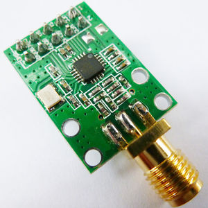

The `cc2500` package provides a Go interface to an SPI-attached
[CC2500 module.](http://www.ti.com/product/CC2500)

The current version supports only the modulation scheme and
packet format used by the Dexcom G4 transmitter.
Patches to support more general use are welcome.

**Note that an antenna must be attached before using the module.**

